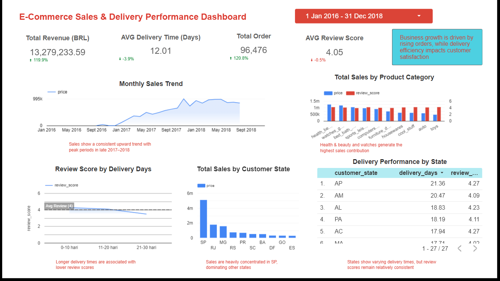

# E-Commerce Sales & Delivery Performance Dashboard — Olist

This project analyzes the Brazilian Olist e-commerce dataset to evaluate sales growth, delivery efficiency, and customer satisfaction using SQL (BigQuery) and Looker Studio.

## Key Insights

- Revenue and orders increased significantly from 2016–2018
- Longer delivery time leads to lower review scores
- Health & Beauty and Watches are top-selling categories
- Sales are heavily concentrated in São Paulo (SP)
- Delivery performance varies by state but review scores remain stable

## Tools
- Google BigQuery (SQL)
- Looker Studio

## Dashboard Preview
(Add your dashboard screenshots here after upload)

## SQL Queries
All SQL queries used for analysis are included in this repository.
